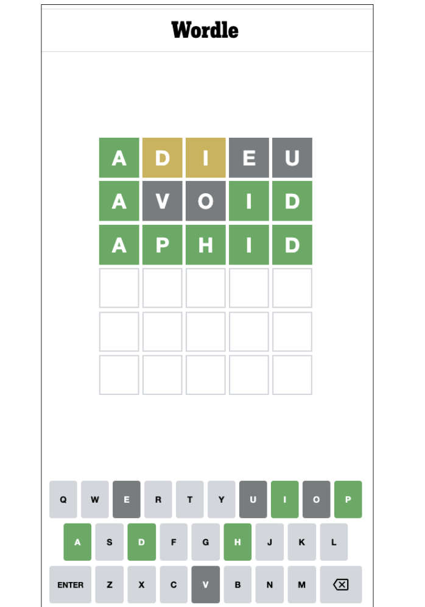
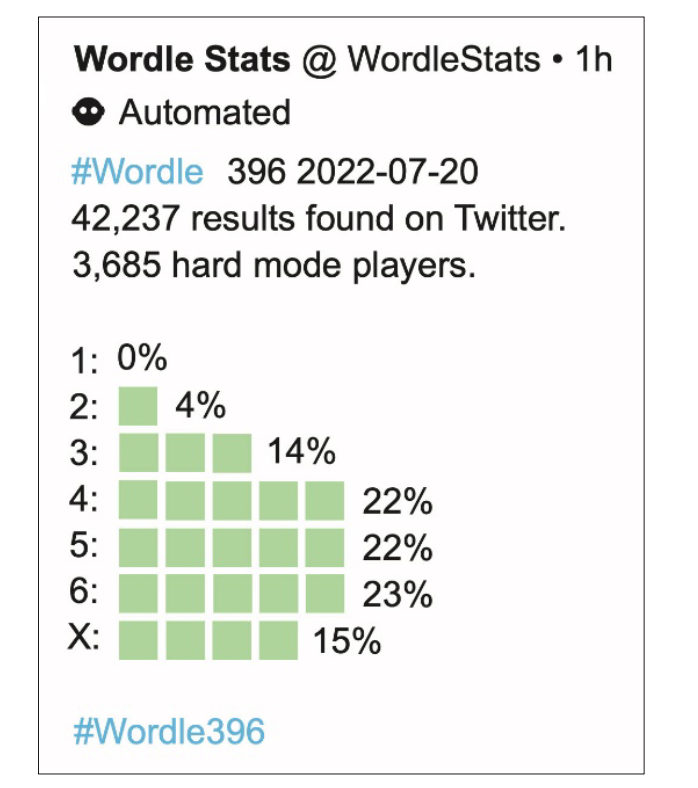
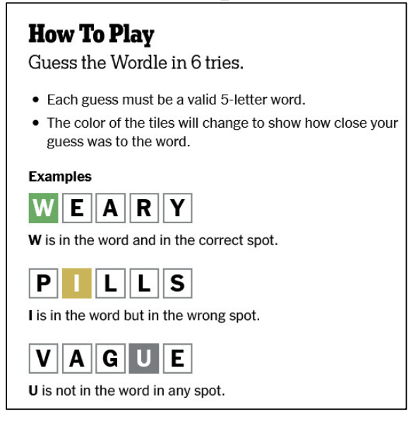

# Machine Learning-based Data Analysis of Word Puzzles


## Introduction

Word puzzles inherently contain uncertainty, making the game data worth analyzing. This project aims to analyze the popularity, difficulty, and other relevant data of word puzzle games using various machine learning techniques.



## Objectives

1. Analyze the popularity of the game.
2. Analyze the difficulty of the game.
3. Conduct other data analyses related to the game.



## Methodology



### Part 1: Analyzing Game Popularity

- **Measure**: Used Contest as a measure of time variation.
- **Technique**: Analyzed the relationship between Contest and the number of reported results using Polynomial Regression.
- **Findings**: A fifth-degree polynomial equation provided the most accurate and stable representation of this relationship. Predicted values from this function were used for further analyses.
- **Word Attributes**:
  - Used Item Response Theory (IRT) to model word difficulty coefficients.
  - Found that the proportion of Hard Mode usage significantly impacted the effects of word attributes.
  - Compared datasets with high and low proportions of Hard Mode to identify differences in attribute effects between Hard Mode and Normal Mode.
  - Examined the influence of word difficulty coefficients on the next day’s Hard Mode change rate and conducted a qualitative evaluation of the relationship.

### Part 2: Analyzing Game Difficulty

- **Analysis**: Conducted qualitative and quantitative analysis of word properties and parameterized these attributes.
- **Technique**: Used a Multiple Linear Regression model to establish a multivariate relationship between word properties and associated percentages of try times.
- **Findings**: The model provided accurate predictions.
- **Clustering**: Utilized K-means++ Clustering analysis to establish a word difficulty classification system, which demonstrated excellent results.

### Part 3: Other Data Analyses

- **Correlation Analysis**: Due to the limited number of data, we used Correlation Analysis to obtain the correlation coefficient between the number of tries.
- **Findings**: Concluded the relationship between different times of tries.

## Results

- **Popularity**: Identified the relationship between Contest and reported results using Polynomial Regression.
- **Difficulty**: Established a multivariate relationship between word properties and try times using Multiple Linear Regression and classified word difficulty using K-means++ Clustering.
- **Other Analyses**: Conducted Correlation Analysis to understand the relationship between different times of tries.

## Strengths and Weaknesses

- **Strengths**: Successfully applied multiple machine learning techniques to analyze word puzzle data.
- **Weaknesses**: Unable to complete sensitivity and robustness analysis due to time constraints. With sufficient time and more data, the model could be further optimized.

## Keywords

- Multiple Linear Regression
- Polynomial Regression
- K-means++ Clustering
- Item Response Theory (IRT)
- Correlation Analysis

## Installation

1. Clone the repository:
    ```bash
    git clone https://github.com/yourusername/word-puzzle-analysis.git
    ```

2. Navigate to the project directory:
    ```bash
    cd word-puzzle-analysis
    ```

3. Install required dependencies:
    ```bash
    pip install -r requirements.txt
    ```

## Usage

- Run the main script to perform data analysis:
    ```bash
    python main.py
    ```

## Contributing

- Contributions are welcome! Please submit a pull request or open an issue for any suggestions or improvements.

## License

- This project is licensed under the MIT License.
